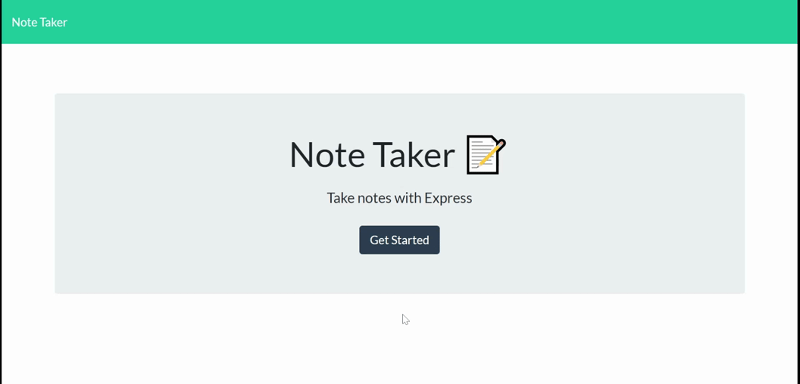

# Note Taker

## Description

Please view my application by clicking this link: [Note Taker](https://aqueous-headland-76108.herokuapp.com/).

_Note Taker_ is an Express.js powered note taking application. _Note Taker_ has a server where the notes are stored--anyone who visits my application can see any notes left by anyone else who's been on my site. Additionally, they can leave a new note by filling out the "New Note" fields or clicking the `+` button at the top of the page. Notes can sort of be deleted. I will address that further in [Future Developments](#future%20developments). Until then, behold!  
  

### Table of Contents
- [Installation](#installation)
- [Usage](#usage)
- [Technologies](#technologies)
- [Future Developments](#future%20developments)

## Installation
The following installation instructions are only to be followed if you're running _Note Taker_  locally on your machine.    
At the root level of the application, open your terminal and install the following:

- Install the NPM file package: `npm i -y`
- For best results when running _Note Taker_ locally, install Nodemon: `npm i -g nodemon`

## Usage
_Note Taker_ can be used on the server hosted by Heroku by clicking this link: [Note Taker](https://aqueous-headland-76108.herokuapp.com/).  
If you're running _Note Taker_ locally, first refer to [Installation](#installation).  
To run _Note Taker_, open your terminal at the root level of the application. Any of these commands will start _Note Taker_:
- `npm start`,
- `node server.js`, or
- `nodemon server` if you chose to install Nodemon.

## Technologies
- [Express.js](https://expressjs.com/)
- [UUID](https://www.npmjs.com/package/uuid)

### Middleware
- [express.urlencoded](http://expressjs.com/en/5x/api.html#express.urlencoded)
- [express.json](http://expressjs.com/en/api.html#express.json)
- [express.static](http://expressjs.com/en/5x/api.html#express.static)

## Future Developments
My application only sort of deletes notes. For the demo above, I ran my application locally using Nodemon. That way the server stayed on and updated itself. Only then does the delete function work. I thought using `fs.readFile` and `fs.writeFile` would take care of that. I need to do more digging as to why my delete route only works when my server restarts. 

